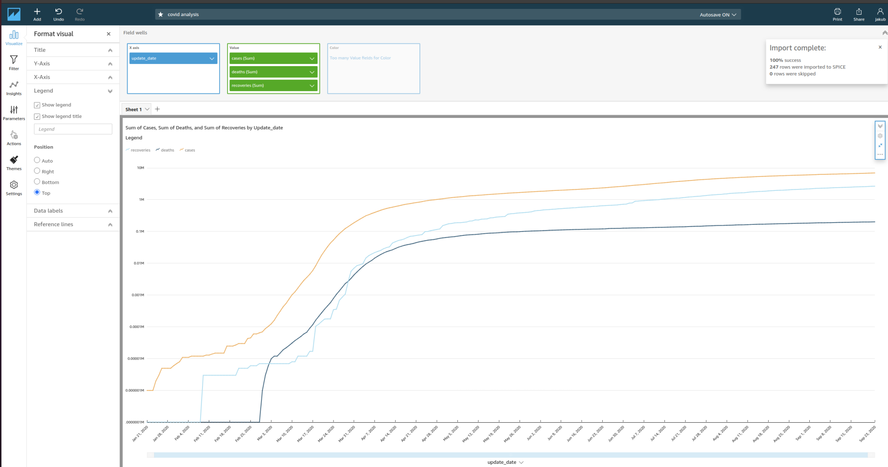

# cloud-guru-challenge

Repository containing the implementation of the system described in the [cloud guru blog post](https://acloudguru.com/blog/engineering/cloudguruchallenge-python-aws-etl).

## Challenge description

The goal was to develop a system that would pull multiple CSV files from github once a day, clean and merge certain rows and write them to a database. Every successful or failed execution should trigger a notification. It should also be possible to view a visualisation of the stored data.

## Solution description

Lambda seemed like the perfect candidate for regular, scheduled, short tasks and RDS seems like the perfect destination to store csv data. The goal was to keep the solution within AWS, so QuickSight was chosen as the visulation tool. To make the solution more secure, I wanted to keep the database in a private subnet - which in turn required the lambda to be moved to the VPC to be able to connect to the database.

Setting up the networking is a breeze using terraform - it makes it really convenient to set up multiple subnets across AZs, set up NAT and internet gateways and configure route tables. The solution has a public subnet, with a route to the internet gateway, and two private subnets with a route to the nat gateway that makes sure that the Lambda function running in the private subnet can still connect to the internet to fetch the csv files. Lambda requires access to at least two subnets to ensure reliability.

Terraform's ability to generate random strings allows to generate random username and password for the database and store them in secrets manager. One way to ensure the users can't leak the password is to never share it with them.

The Lamda function uses `requests` to fetch data from github and `psycopg2` to talk to the postgres DB. The processing of the data is easily achieved using dict comprehensions. The SQL queries creating the tables and loading the data are written to handle both initial load and every subsequent run; the data loading uses postgres-specific SQL syntax to upsert all fetched data with updates only taking place if any column in a row has changed. The same query returns the [xmax system column](https://www.cybertec-postgresql.com/en/whats-in-an-xmax/) that is later used to determine whether the operation was an insert or an update. Evaluating the total number of updates and inserts happens in python using the results - while it would have been possible calculate that number in SQL, it would lead to less readable code.

## QuickSight dashboard

Unfortunately, as QuickSight is not supported by any IaaC tool, the solution description cannot be included in this repo. AWS does provide [good documentation](https://aws.amazon.com/premiumsupport/knowledge-center/quicksight-redshift-private-connection/) on how to get it to work with private networks, although it will seem non-obvious that it's a premium feature. It will also take some time for connectivity to private networks to be established - in my case it was upwards of 30 minutes.

## Lessons learned

1. Lambda package folder structure is different when uploading the source together with dependencies compared to when uploading the dependencies as a layer.
2. Using layers makes it possible to modify the lambda function inline, which is useful for debugging.
3. Moving a lambda function to a VPC adds complexity to the design.
4. Lambda-triggered events don't get triggered for synchronous events, i.e. if a lambda function failure sends an SNS trigger, using the test scenarios from the console (a synchronous event) won't send the notification when expected. Invoking the lambda using AWS CLI (asynchronous event, returns immediately) has to be used to test the trigger instead.
5. Terraform using zip file hashes to determine whether lambda layer or function should be updated is really neat.
6. The way to execute bulk queries well using Psycopg2 is non-obvious - `cursor.executemany` is slower than `cursor.executevalues` and the former does not return the results of the query.
7. Postgres SQL flavour has some really elegant features.
8. AWS Quicksight seems underwhelming as a visualisation tool, that's pretty removed from the rest of AWS products.
   1. The lack of support for either cloudformation or terraform is disappointing.
   2. The fact that being able to access DBs in private networks requires enterprise subscription is shocking.
